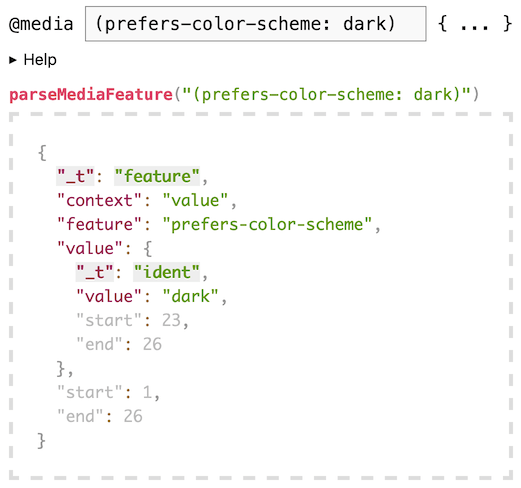

# `media-query-parser`

[](https://www.npmjs.com/package/media-query-parser)
[](#)
[](#)
[](https://www.npmjs.com/package/media-query-parser)
[](https://packagephobia.com/result?p=media-query-parser)

- **Create a JS object from a CSS media queries**
- **Create a CSS media query from a JS object**
- **Returns a ParserError for invalid CSS media queries**
- **Spec-compliant** - https://www.w3.org/TR/mediaqueries-5/
  - **All valid queries parsed  
    e.g. `(100px < width < 200px)`**
- **Zero-dependencies**
- **Well tested** - every single line
- **TypeScript friendly**

> This repo/package contains only the parser, stringify and isParserError.
>
> `media-query-fns` uses this library internally to achieve common use-cases.

  
[Try it!](https://tbjgolden.github.io/media-query-parser/playground/)

## Why?

Other CSS parsers (e.g. css-tree and postcss) do not support all media query syntax out of the box.

Further, the only other media query parser that I'm aware of is `postcss-media-query-parser` - which
is specific to postcss and doesn't parse newer syntax like range expressions (i.e.
`(width >= 768px)`).

This package is a spec-compliant media query parser that can be used in Node/Deno/etc, or on the
client that precisely matches the spec right down to the quirks.

These are valid media queries that this library supports:

```css
@media (768px <= width < 1200px);
@media only print and (color);
@media not (not (not (((hover) or ((not (color)))))));
@media (🐈: 😸 /* if cat happy */) {
  /* this query has valid syntax, but is clearly not a real feature 😿 */
  /* For extensions to this project, check out "Libraries that use this" at the bottom of this README */
}
```

These are invalid media queries that this library will detect:

```css
@media (color) or (hover); /* or cannot be at top level */
@media (min-width: calc(50vw + 10px)); /* functions aren't valid values */
@media not((color)); /* whitespace must follow `not` */
@media (768px < = width < 1200px); /* cannot have a space between `<` and `=` */
```

## Install

This package is available from the `npm` registry.

```sh
npm install media-query-parser
```

## Usage

Supports JavaScript + TypeScript:

```ts
import { parseMediaQuery } from "media-query-parser";

const mediaQuery = parseMediaQuery("screen and (min-width: 768px)");
if (!isParserError(mediaQuery)) {
  console.log(mediaQuery);
  // {
  //   _t: "query",
  //   type: "screen",
  //   condition: {
  //     _t: "condition",
  //     op: "and",
  //     nodes: [
  //       {
  //         _t: "in-parens",
  //         node: {
  //           _t: "feature",
  //           context: "value",
  //           feature: "min-width",
  //           value: {
  //             _t: "dimension",
  //             value: 768,
  //             unit: "px",
  //           },
  //         },
  //       },
  //     ],
  //   },
  // }
  // // start/end omitted for brevity

  console.log(stringify(mediaQuery.condition));
  // "(min-width: 768px)"
}
```

Can also be imported via `require("media-query-parser")`.

### [**v3 (Current) Docs**](https://tbjgolden.github.io/media-query-parser/)

###### [_v2 API docs_](https://github.com/tbjgolden/media-query-parser/tree/v2.0.2/docs/api#functions)

## Libraries that use this

- (See GitHub for dynamically updated list)

## Contributing

- PRs welcome and accepted, simply fork and create
- Issues also very welcome
- Treat others with common courtesy and respect 🤝

Dev environment (for contributing) requires:

- node >= 16.14.0
- npm >= 6.8.0
- git >= 2.11

## Licence

MIT
